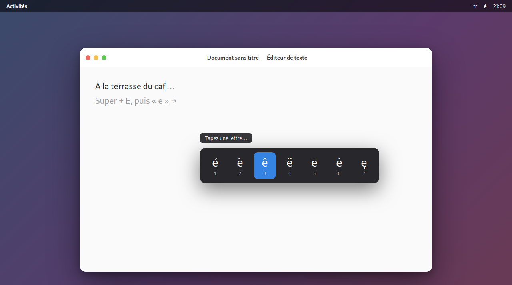

# Accent Hold

*Lire dans une autre langue : [English](README.md)*

> **Tapez les caractères accentués à la façon macOS — sans daemon ni privilèges.**
> Appuyez sur un raccourci configurable, tapez une lettre de base (`e`, `a`, `c`,
> `o`, `n` …), puis choisissez la variante accentuée voulue (`é è ê ë`, `ç`, `ñ`,
> `ô` …) dans une popup nette. Le caractère est inséré là où se trouve le curseur —
> champs texte, éditeurs et terminal compris. Un panneau de préférences intégré
> permet de régler le raccourci, le délai, la table de caractères et les claviers
> actifs. Extension GNOME Shell pure — aucun daemon, aucun privilège, aucune
> dépendance, installable en un clic depuis extensions.gnome.org.



## Utilisation

1. `Super+E` (raccourci configurable)
2. tape une lettre de base : `e`, `a`, `c`, `o`, `u`, `n`, `s`, `i`, `y`, `z`
3. choisis la variante : `1`–`9`, ou `←`/`→` + `Entrée`, ou clic. `Échap` annule.

Le caractère est inséré dans le champ qui avait le focus (terminal compris).
Shift est détecté : `E` propose `É È Ê Ë …`.

## Installer

### Pour un utilisateur (le plus simple)
Sur **extensions.gnome.org**, clique **« Install »**. Fin. Pas de terminal,
pas de sudo, pas de daemon — c'est une extension Shell pure.

### Construire le paquet à uploader
```bash
./pack.sh
```
Génère `accent-hold@griffit.gmail.com.shell-extension.zip` à la racine du dépôt,
prêt à être déposé sur <https://extensions.gnome.org/upload/>.

### En local (dev)
```bash
gnome-extensions install --force accent-hold@griffit.gmail.com.shell-extension.zip
# déconnexion/reconnexion (Wayland), puis :
gnome-extensions enable accent-hold@griffit.gmail.com
```

## Préférences

Panneau de configuration intégré (icône réglages dans l'app *Extensions*, ou
`gnome-extensions prefs accent-hold@griffit.gmail.com`) :

- **Raccourci** : la touche qui ouvre le sélecteur (défaut `Super+E`).
- **Activer / inhiber** : coupe le raccourci sans désinstaller l'extension.
- **Délai (ms)** : latence avant l'affichage de la popup (0–1000).
- **Caractères** : table des variantes accentuées (JSON), surchargeable.
- **Claviers** : liste des layouts xkb où l'extension est active (vide = tous).

Tout est stocké dans GSettings
(`org.gnome.shell.extensions.accent-hold`). En CLI :
```bash
gsettings set org.gnome.shell.extensions.accent-hold trigger "['<Super>grave']"
```

## Pourquoi un raccourci et pas « maintenir la lettre » ?

Sous Wayland, intercepter le **maintien d'une lettre normale** dans une autre
application impose un accès clavier privilégié (evdev) → daemon + `sudo` +
groupe `input` + `udev` : impossible à distribuer simplement. Le raccourci
global est capté nativement par le Shell, sans aucun privilège — d'où une
extension installable en un clic.

La variante « vrai maintien de la lettre » (daemon Rust evdev + uinput) existe
dans [`legacy/`](legacy/) : plus fidèle à macOS, mais install lourde
(`sudo`, `usermod`, `udev`, logout). Non recommandée pour la distribution.

## Alternative zéro-install : la touche Compose

Sans rien installer, GNOME sait déjà taper les accents partout :
```bash
gsettings set org.gnome.desktop.input-sources xkb-options "['compose:caps']"
```
Puis `Compose`(Verr.Maj) `e` `'` → é. Pas de popup, mais zéro dépendance.

## Licence

[GPL-2.0-or-later](LICENSE).
