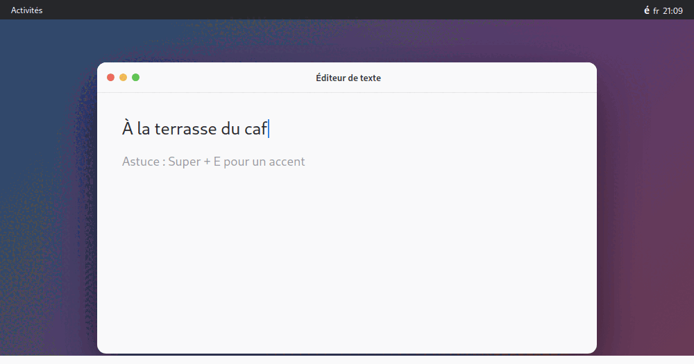

# Accent Hold

*Read this in another language: [Français](README.fr.md)*

> **Type accented and special characters the macOS way — without a daemon or root.**
> Press a configurable shortcut, type a base letter (`e`, `a`, `c`, `o`, `n` …),
> then pick the accented variant you want (`é è ê ë`, `ç`, `ñ`, `ô` …) from a clean
> popup. The chosen character is injected wherever your cursor is — text fields,
> editors and the terminal included. A built-in preferences panel lets you customize
> the shortcut, the popup delay, the character table and the active keyboard layouts.
> Pure GNOME Shell extension — no daemon, no privileges, no dependencies, one-click
> install from extensions.gnome.org.



## Usage

1. `Super+E` (configurable shortcut)
2. type a base letter: `e`, `a`, `c`, `o`, `u`, `n`, `s`, `i`, `y`, `z`
3. pick the variant: `1`–`9`, or `←`/`→` + `Enter`, or click. `Esc` cancels.

The character is inserted into the field that had focus (terminal included).
Shift is detected: `E` offers `É È Ê Ë …`.

## Install

### For a user (the simplest way)
On **extensions.gnome.org**, click **“Install”**. Done. No terminal, no sudo,
no daemon — it is a pure Shell extension.

### Build the package to upload
```bash
./pack.sh
```
Produces `accent-hold@griffit.gmail.com.shell-extension.zip` at the repo root,
ready to be submitted at <https://extensions.gnome.org/upload/>.

### Locally (dev)
```bash
gnome-extensions install --force accent-hold@griffit.gmail.com.shell-extension.zip
# log out / log back in (Wayland), then:
gnome-extensions enable accent-hold@griffit.gmail.com
```

## Preferences

Built-in settings panel (the settings icon in the *Extensions* app, or
`gnome-extensions prefs accent-hold@griffit.gmail.com`):

- **Shortcut** — the key that opens the picker (default `Super+E`).
- **Enable / disable** — turns the shortcut off without uninstalling the extension.
- **Delay (ms)** — latency before the popup appears (0–1000).
- **Characters** — table of accented variants (JSON), overridable.
- **Keyboards** — list of xkb layouts where the extension is active (empty = all).

Everything is stored in GSettings
(`org.gnome.shell.extensions.accent-hold`). From the CLI:
```bash
gsettings set org.gnome.shell.extensions.accent-hold trigger "['<Super>grave']"
```

## Why a shortcut and not “hold the letter”?

On Wayland, intercepting the **hold of a normal letter** inside another
application requires privileged keyboard access (evdev) → daemon + `sudo` +
`input` group + `udev`: impossible to distribute simply. A global shortcut is
captured natively by the Shell, with no privileges — hence a one-click extension.

The “true hold-the-letter” variant (Rust evdev + uinput daemon) lives in
[`legacy/`](legacy/): closer to macOS, but a heavy install (`sudo`, `usermod`,
`udev`, logout). Not recommended for distribution.

## Zero-install alternative: the Compose key

Without installing anything, GNOME can already type accents everywhere:
```bash
gsettings set org.gnome.desktop.input-sources xkb-options "['compose:caps']"
```
Then `Compose`(Caps Lock) `e` `'` → é. No popup, but zero dependencies.

## License

[GPL-2.0-or-later](LICENSE).
